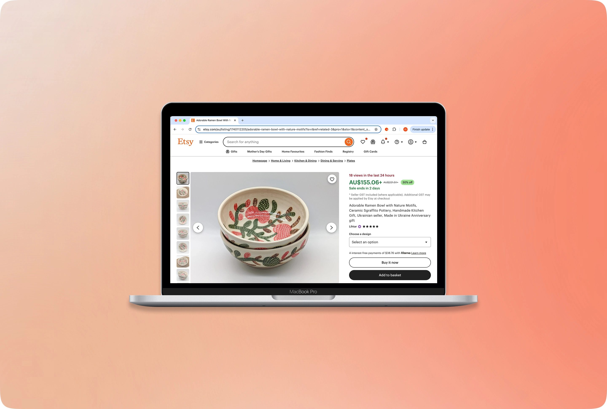
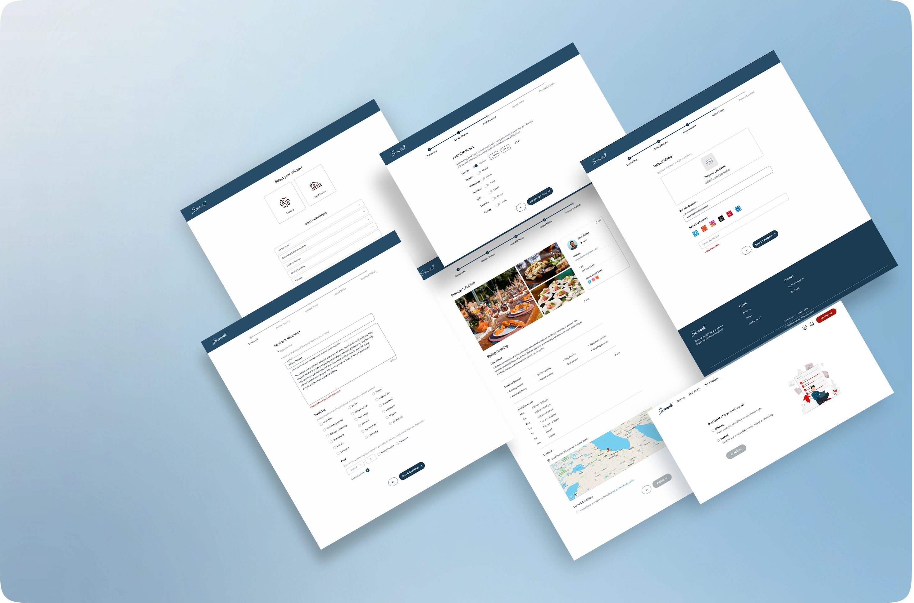
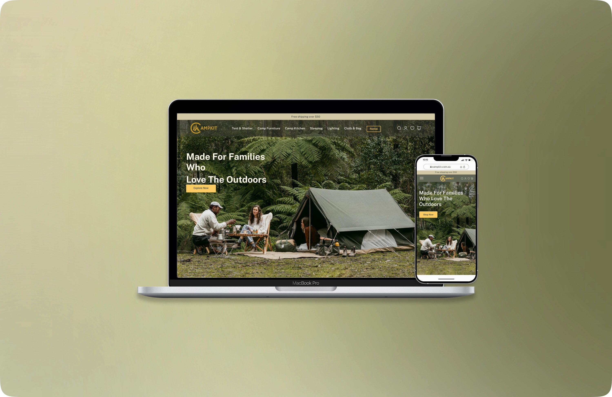
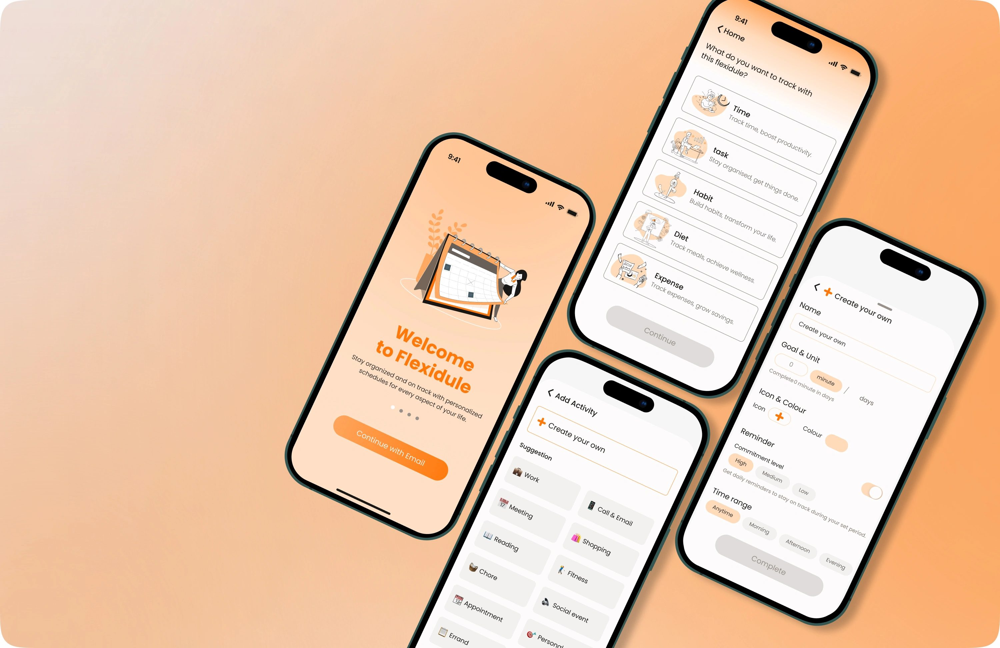

# Behnaz Korzebor — UX/UI Portfolio

🔗 **Live site:** [behnaz-shayan.github.io/behnaz-portfolio](https://behnaz-shayan.github.io/behnaz-portfolio/)

A UX/UI design portfolio showcasing case studies in user research, interaction design, and iterative prototyping — from e-commerce trust and conversion, to service-marketplace onboarding, to responsive product design across devices.

---

### Etsy

Investigated how trust cues influence purchasing decisions and redesigned the product page to address credibility issues contributing to cart abandonment.

---

### SeeWalls

Explored how service providers create online listings and designed a user-centered posting workflow that simplifies the submission process.

---

### Campkit

Designed a responsive camping platform by considering users' goals, navigation patterns, and contextual needs across devices.

---

### Flexidule

Investigated how rigid scheduling affects users' planning behavior and designed a flexible goal-planning experience that balances autonomy and accountability.

---

## Contact

- Email: shayanbehnaz@gmail.com
- LinkedIn: [linkedin.com/in/behnaz-korzebor-5b9835239](https://www.linkedin.com/in/behnaz-korzebor-5b9835239)
- GitHub: [github.com/Behnaz-shayan](https://github.com/Behnaz-shayan)
